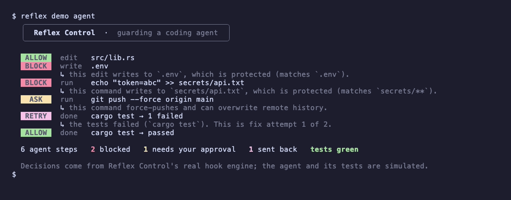

# Hi, I'm Murat

I build tools in Rust that keep AI coding agents in check: the boring checks that stop an agent from touching your secrets or calling a task done while the tests fail. I also run small model experiments and publish the results even when they don't work.

## Reflex Control

Reflex Control is my main project: a Rust CLI that plugs into Claude Code, Cursor and Codex CLI as a hook (more agents on main).
- Blocks writes to files you protect (like `.env` or `secrets/**`).
- Asks before risky shell commands (like a force push).
- Runs your tests at the end of a turn when the agent says it is done, sending failures back to the agent a limited number of times.

```sh
curl -fsSL https://raw.githubusercontent.com/rustfuture/reflex-control/main/install.sh | sh
export PATH="$HOME/.local/bin:$PATH"
reflex demo agent
```

Run `reflex install` to launch the interactive setup wizard.



[Repository](https://github.com/rustfuture/reflex-control) · [Design](https://github.com/rustfuture/reflex-control/blob/main/docs/architecture.md) · [Evaluation](https://github.com/rustfuture/reflex-control#evaluation-benchmark--measured-results)

## Other tools I built

- [Rust Agent Runtime](https://github.com/rustfuture/rust-agent-runtime): runs coding tasks with command allowlists, timeouts and required verification, and records task state in an append-only log.
- [Repository Intelligence](https://github.com/rustfuture/repository-intelligence): searches local code and answers with exact source lines instead of prose; works offline. Quotes are verbatim; relevance is not guaranteed.
- [grainx](https://github.com/rustfuture/grainx): displays CPU, memory, disk, network and processes in the terminal; can share readings over a local HTTP service and export JSON/CSV.
- [deltasafe](https://github.com/rustfuture/deltasafe): sends files between computers on the same local network and checks that each file arrived unchanged.
- [RustHound](https://github.com/rustfuture/RustHound): reads log files and reports lines that match rules or look unusual.

## Experiments, including the ones that didn't work

- [Model Adaptation Lab](https://github.com/rustfuture/model-adaptation-lab): I tried LoRA fine-tuning on a small model (Qwen2.5-Coder-1.5B) to explain Rust compiler errors; the recorded run showed no gain ([report](https://github.com/rustfuture/model-adaptation-lab/blob/main/reports/negative-result.md)).
- [RLT-RSI Experiment](https://github.com/rustfuture/rlt-rsi-experiment): I tested reusing model layers in a loop on a sequence parity task; the runs stayed at chance level.
- [RSI Experimental Framework](https://github.com/rustfuture/rsi-experimental-framework): a loop that proposes and keeps keyword rules for text classification on a small synthetic dataset.

If you run into a bug or have ideas, please open an issue on any repo.
