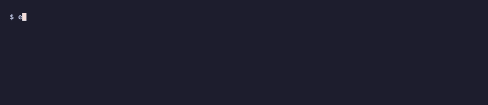

# rustfuture

I build tools and guardrails for AI coding agents and small local Rust utilities, and run model experiments in Rust and Python.

These are experimental projects. Each repository documents its run instructions, tests and limitations.

Currently: safety gates for coding agents. Reflex Control 0.4.0 hooks into Claude Code, Cursor, Codex CLI and git pre-commit; adapters for OpenCode, Kilo Code, Cline and pi are on `main`.

Try Reflex Control without installing Rust (macOS or Linux):

```sh
curl -fsSL https://raw.githubusercontent.com/rustfuture/reflex-control/main/install.sh | sh
export PATH="$HOME/.local/bin:$PATH"
reflex demo verifier-gate
```

On Windows, use the [PowerShell installer](https://github.com/rustfuture/reflex-control/blob/main/install.ps1).

<table>
<tr>
<td width="33%"><a href="https://github.com/rustfuture/reflex-control"></a></td>
<td width="33%"><a href="https://github.com/rustfuture/rust-agent-runtime"></a></td>
<td width="33%"><a href="https://github.com/rustfuture/repository-intelligence"></a></td>
</tr>
</table>

## Coding tools

### [Reflex Control](https://github.com/rustfuture/reflex-control)

Decides when an automated coding step should finish, retry or escalate, using local checks and a safety veto.



[Run the demo](https://github.com/rustfuture/reflex-control#quick-start) · [Design](https://github.com/rustfuture/reflex-control/blob/main/docs/architecture.md) · [Evaluation](https://github.com/rustfuture/reflex-control#evaluation-benchmark--measured-results)

### [Rust Agent Runtime](https://github.com/rustfuture/rust-agent-runtime)

Runs coding tasks with command allowlists, timeouts and required verification; task state is recorded in an append-only log.

[Try the task lifecycle](https://github.com/rustfuture/rust-agent-runtime#quick-start) · [Design](https://github.com/rustfuture/rust-agent-runtime/blob/main/docs/architecture.md) · [Evaluation](https://github.com/rustfuture/rust-agent-runtime#evaluation-evidence)

### [Repository Intelligence](https://github.com/rustfuture/repository-intelligence)

Searches local code and returns exact source lines. Quotes match the source; relevance is not guaranteed.

[Try offline search](https://github.com/rustfuture/repository-intelligence#quick-start) · [Design](https://github.com/rustfuture/repository-intelligence/blob/main/docs/architecture.md) · [Results](https://github.com/rustfuture/repository-intelligence#measured-results)

## Model experiments

| Project | Question and recorded scope | Explore |
|---|---|---|
| [RSI Experimental Framework](https://github.com/rustfuture/rsi-experimental-framework) | Propose and select keyword-rule changes on synthetic text; held-out data is scored after selection. | [Run](https://github.com/rustfuture/rsi-experimental-framework#quick-start) · [Results](https://github.com/rustfuture/rsi-experimental-framework#measured-results) · [](https://colab.research.google.com/github/rustfuture/rsi-experimental-framework/blob/main/notebooks/rsi_open_weight_colab.ipynb) |
| [RLT-RSI Experiment](https://github.com/rustfuture/rlt-rsi-experiment) | Test repeated model layers on sequence parity; committed runs stayed near chance. | [Run](https://github.com/rustfuture/rlt-rsi-experiment#quick-start) · [Results](https://github.com/rustfuture/rlt-rsi-experiment#what-the-committed-results-show) · [](https://colab.research.google.com/github/rustfuture/rlt-rsi-experiment/blob/main/notebooks/rlt_rsi_colab.ipynb) |
| [Model Adaptation Lab](https://github.com/rustfuture/model-adaptation-lab) | Test LoRA for Rust compiler explanations; the recorded run showed no gain. | [Run](https://github.com/rustfuture/model-adaptation-lab#quick-start) · [Report](https://github.com/rustfuture/model-adaptation-lab/blob/main/reports/negative-result.md) · [](https://colab.research.google.com/github/rustfuture/model-adaptation-lab/blob/main/notebooks/validation_colab.ipynb) |

## Local Rust tools

| Tool | First use |
|---|---|
| [deltasafe](https://github.com/rustfuture/deltasafe) | [Transfer a file between two local terminals](https://github.com/rustfuture/deltasafe#quick-start); tested over loopback. |
| [grainx](https://github.com/rustfuture/grainx) | [Open a system dashboard or export JSON/CSV](https://github.com/rustfuture/grainx#quick-start). |
| [RustHound](https://github.com/rustfuture/RustHound) | [Analyze the bundled sample log](https://github.com/rustfuture/RustHound#quick-start). |

Questions and suggestions are welcome as issues on the relevant repository.
